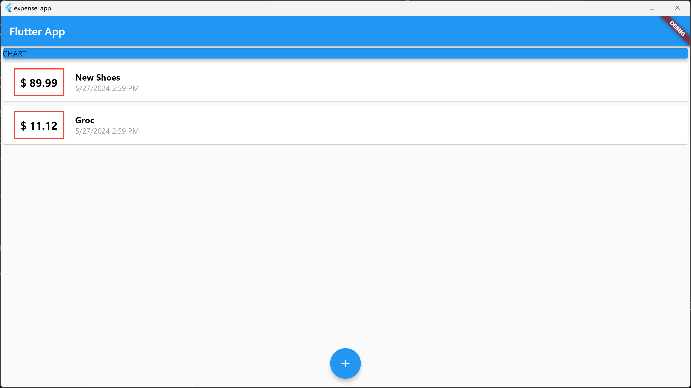

<!-- Insert logo -->

    

# expense app

Hello world to flutter project. Made for windows desktop and chrome web.

## About the project
<!-- Insert snapshot photo -->

## Getting Started

#### Install
<!-- install libraries -->
- [Steps to Setup Flutter on windows](https://docs.flutter.dev/get-started/install/windows/desktop)

#### Usage
<!-- run program -->
- [Steps to Run Flutter in VS Code](https://docs.flutter.dev/get-started/test-drive?tab=vscode)
Run in `Windows (windows-x64)` or `Chrome (web-javascript)`
